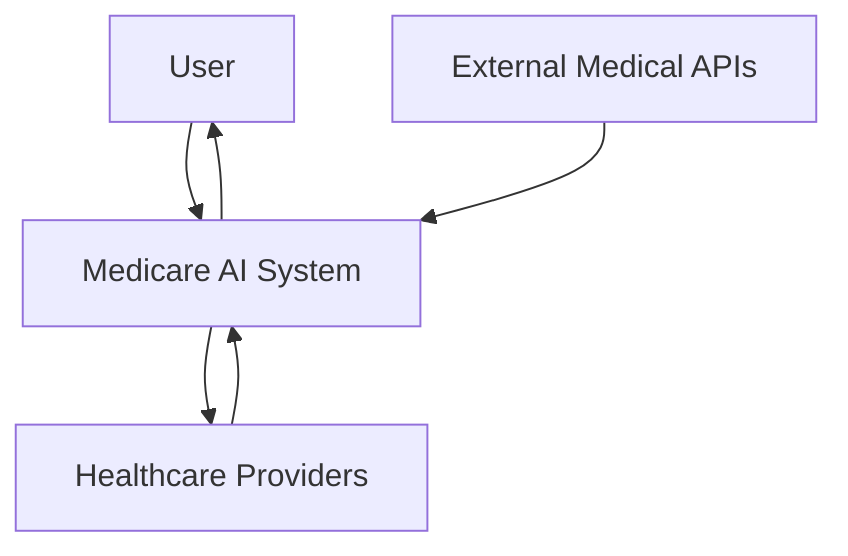
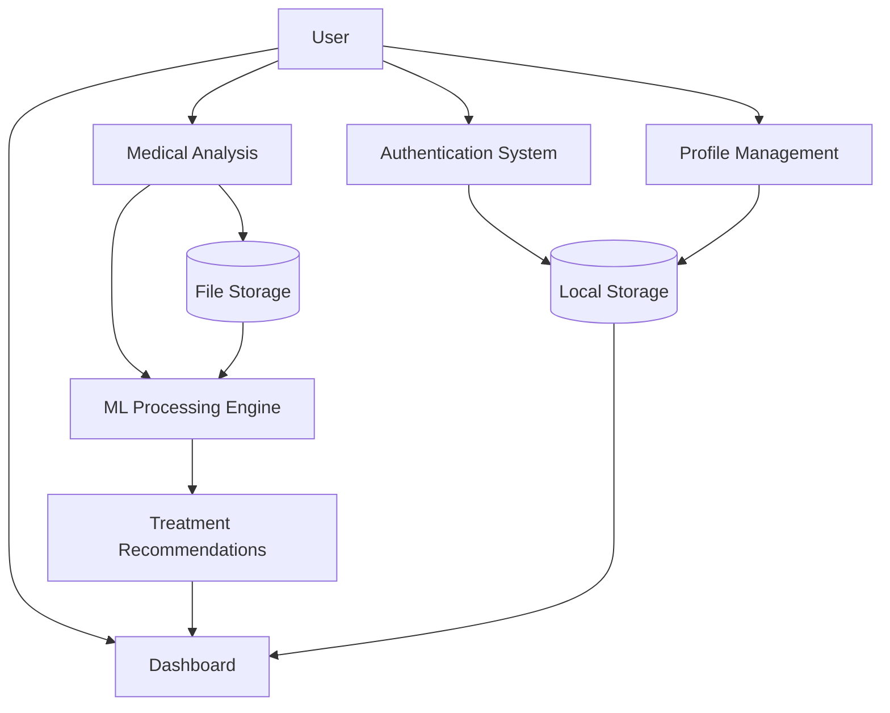
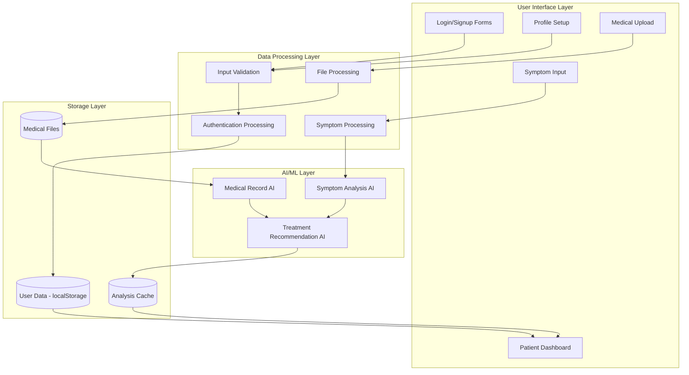
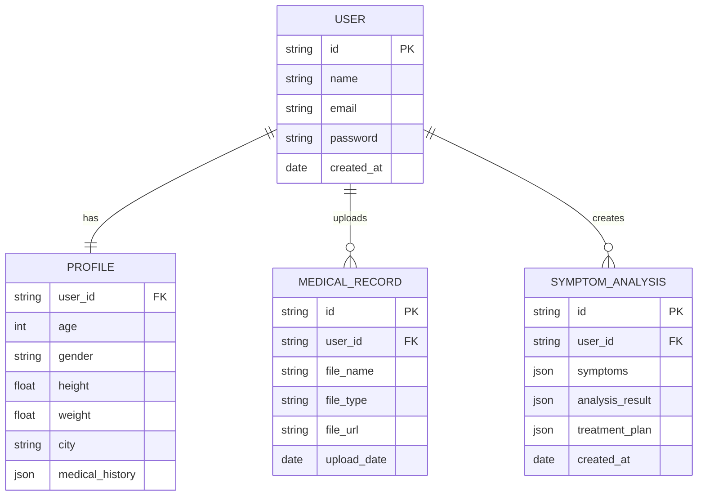

# Medicare AI System - Data Flow Diagrams

## Level 0 - Context Diagram

```mermaid
flowchart TD
    U[User] --> MAS[Medicare AI System]
    MAS --> U
    HC[Healthcare Providers] --> MAS
    MAS --> HC
    EXT[External Medical APIs] --> MAS
```

## Level 1 - System Overview

```mermaid
flowchart TD
    U[User] --> AUTH[Authentication System]
    U --> PROFILE[Profile Management]
    U --> MEDICAL[Medical Analysis]
    U --> DASH[Dashboard]
    
    AUTH --> LS[(Local Storage)]
    PROFILE --> LS
    MEDICAL --> ML[ML Processing Engine]
    ML --> RESULTS[Treatment Recommendations]
    RESULTS --> DASH
    
    MEDICAL --> FS[(File Storage)]
    LS --> DASH
    FS --> ML
```

## Level 2 - Detailed Data Flow

```mermaid
flowchart TD
    subgraph "User Interface Layer"
        LOGIN[Login/Signup Forms]
        PROFILE_SETUP[Profile Setup]
        DASHBOARD[Patient Dashboard]
        UPLOAD[Medical Upload]
        SYMPTOMS[Symptom Input]
    end
    
    subgraph "Data Processing Layer"
        VALIDATE[Input Validation]
        AUTH_PROC[Authentication Processing]
        FILE_PROC[File Processing]
        SYMPTOM_PROC[Symptom Processing]
    end
    
    subgraph "Storage Layer"
        USER_DATA[(User Data - localStorage)]
        MEDICAL_FILES[(Medical Files)]
        ANALYSIS_CACHE[(Analysis Cache)]
    end
    
    subgraph "AI/ML Layer"
        SYMPTOM_AI[Symptom Analysis AI]
        MEDICAL_AI[Medical Record AI]
        TREATMENT_AI[Treatment Recommendation AI]
    end
    
    LOGIN --> VALIDATE
    PROFILE_SETUP --> VALIDATE
    VALIDATE --> AUTH_PROC
    AUTH_PROC --> USER_DATA
    
    UPLOAD --> FILE_PROC
    SYMPTOMS --> SYMPTOM_PROC
    FILE_PROC --> MEDICAL_FILES
    SYMPTOM_PROC --> SYMPTOM_AI
    MEDICAL_FILES --> MEDICAL_AI
    
    SYMPTOM_AI --> TREATMENT_AI
    MEDICAL_AI --> TREATMENT_AI
    TREATMENT_AI --> ANALYSIS_CACHE
    ANALYSIS_CACHE --> DASHBOARD
    USER_DATA --> DASHBOARD
```

## Data Entity Relationships

```mermaid
erDiagram
    USER {
        string id PK
        string name
        string email
        string password
        date created_at
    }
    
    PROFILE {
        string user_id FK
        int age
        string gender
        float height
        float weight
        string city
        json medical_history
    }
    
    MEDICAL_RECORD {
        string id PK
        string user_id FK
        string file_name
        string file_type
        string file_url
        date upload_date
    }
    
    SYMPTOM_ANALYSIS {
        string id PK
        string user_id FK
        json symptoms
        json analysis_result
        json treatment_plan
        date created_at
    }
    
    USER ||--|| PROFILE : "has"
    USER ||--o{ MEDICAL_RECORD : "uploads"
    USER ||--o{ SYMPTOM_ANALYSIS : "creates"
```
