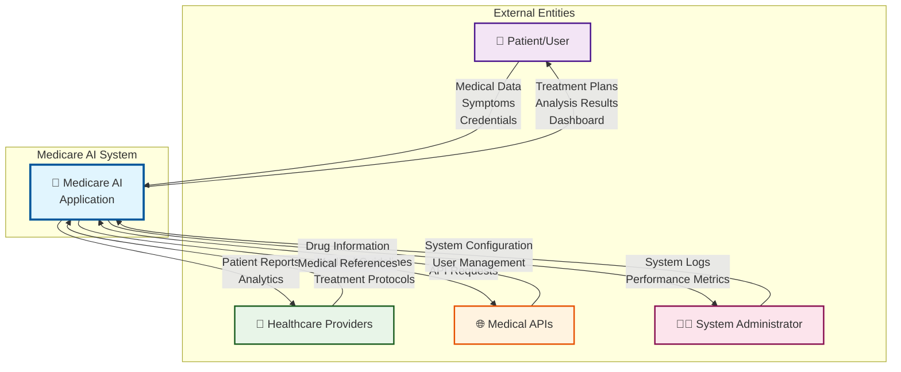
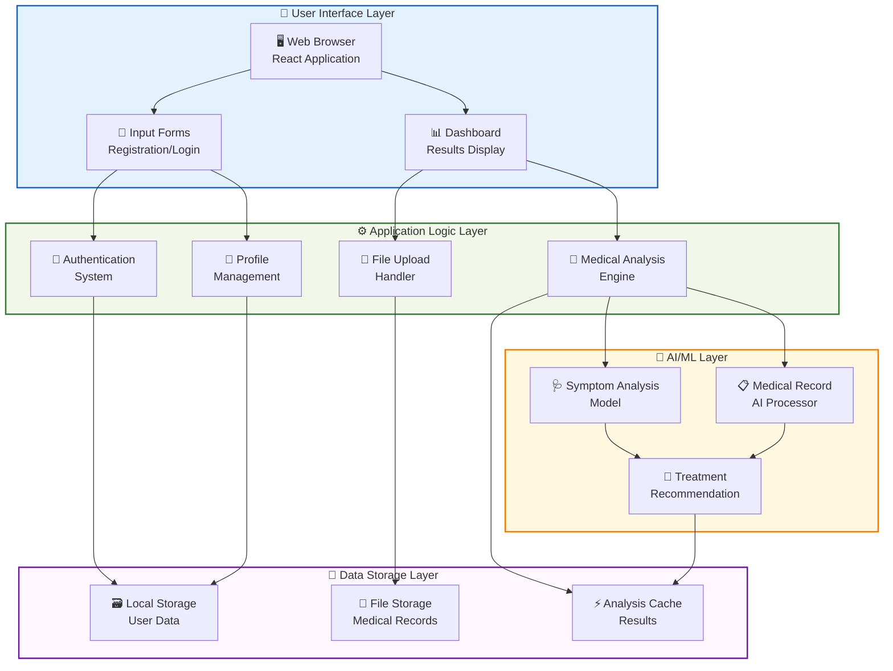
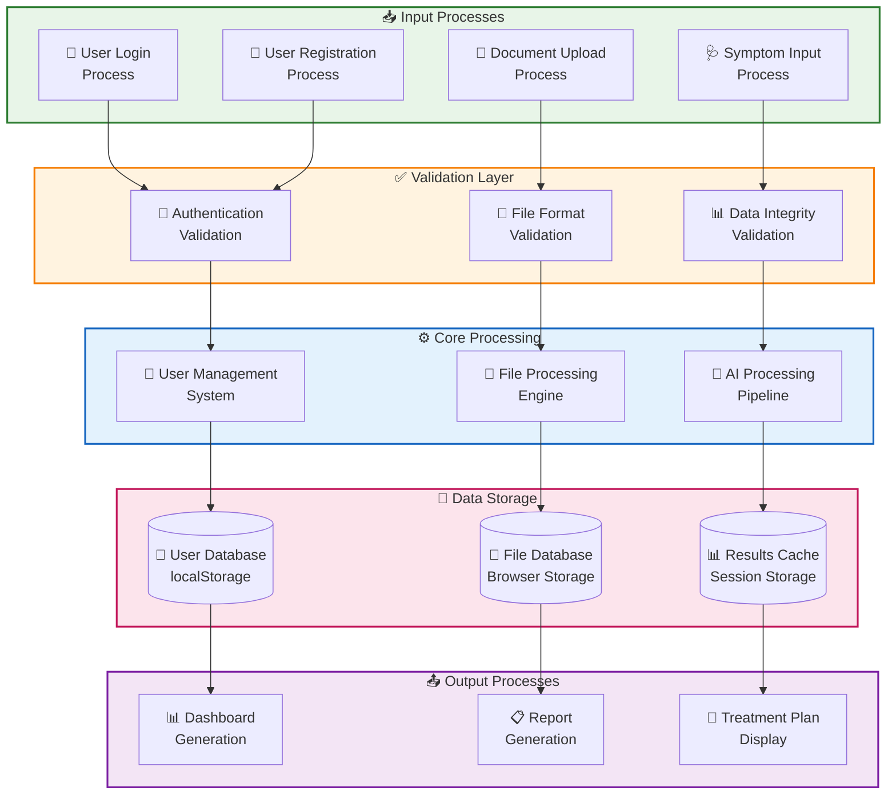
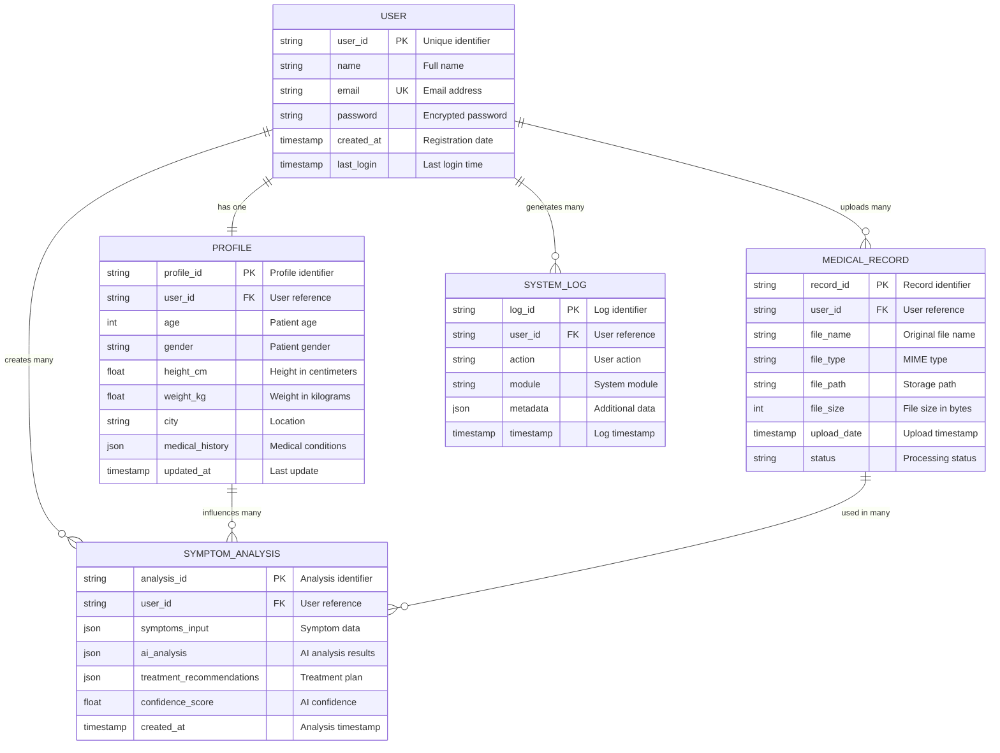

# Medicare AI System - Data Flow Diagrams

## Context Diagram (Level 0)

```mermaid
flowchart TD
    subgraph External[External Entities]
        U[👤 Patient/User]
        HC[🏥 Healthcare Providers]
        API[🌐 Medical APIs]
        ADMIN[👨‍💼 System Administrator]
    end
    
    subgraph System[Medicare AI System]
        MAS[📱 Medicare AI<br/>Application]
    end
    
    U -->|Medical Data<br/>Symptoms<br/>Credentials| MAS
    MAS -->|Treatment Plans<br/>Analysis Results<br/>Dashboard| U
    
    HC -->|Medical Guidelines<br/>Treatment Protocols| MAS
    MAS -->|Patient Reports<br/>Analytics| HC
    
    API -->|Drug Information<br/>Medical References| MAS
    MAS -->|API Requests| API
    
    ADMIN -->|System Configuration<br/>User Management| MAS
    MAS -->|System Logs<br/>Performance Metrics| ADMIN

    style MAS fill:#e1f5fe,stroke:#01579b,stroke-width:3px
    style U fill:#f3e5f5,stroke:#4a148c,stroke-width:2px
    style HC fill:#e8f5e8,stroke:#1b5e20,stroke-width:2px
    style API fill:#fff3e0,stroke:#e65100,stroke-width:2px
    style ADMIN fill:#fce4ec,stroke:#880e4f,stroke-width:2px
```

## Level 1 - System Decomposition

```mermaid
flowchart TD
    subgraph User[👤 User Interface Layer]
        WEB[🖥️ Web Browser<br/>React Application]
        FORMS[📝 Input Forms<br/>Registration/Login]
        DASH[📊 Dashboard<br/>Results Display]
    end
    
    subgraph Processing[⚙️ Application Logic Layer]
        AUTH[🔐 Authentication<br/>System]
        PROFILE[👤 Profile<br/>Management]
        UPLOAD[📁 File Upload<br/>Handler]
        ANALYSIS[🧠 Medical Analysis<br/>Engine]
    end
    
    subgraph Data[💾 Data Storage Layer]
        LOCAL[🗃️ Local Storage<br/>User Data]
        FILES[📂 File Storage<br/>Medical Records]
        CACHE[⚡ Analysis Cache<br/>Results]
    end
    
    subgraph AI[🤖 AI/ML Layer]
        SYMPTOM_AI[🩺 Symptom Analysis<br/>Model]
        MEDICAL_AI[📋 Medical Record<br/>AI Processor]
        TREATMENT_AI[💊 Treatment<br/>Recommendation]
    end
    
    WEB --> FORMS
    WEB --> DASH
    FORMS --> AUTH
    FORMS --> PROFILE
    DASH --> UPLOAD
    DASH --> ANALYSIS
    
    AUTH --> LOCAL
    PROFILE --> LOCAL
    UPLOAD --> FILES
    ANALYSIS --> CACHE
    
    ANALYSIS --> SYMPTOM_AI
    ANALYSIS --> MEDICAL_AI
    SYMPTOM_AI --> TREATMENT_AI
    MEDICAL_AI --> TREATMENT_AI
    TREATMENT_AI --> CACHE
    
    style User fill:#e3f2fd,stroke:#1565c0,stroke-width:2px
    style Processing fill:#f1f8e9,stroke:#2e7d32,stroke-width:2px
    style Data fill:#fef7ff,stroke:#6a1b9a,stroke-width:2px
    style AI fill:#fff8e1,stroke:#f57c00,stroke-width:2px
```

## Level 2 - Detailed Process Flow

```mermaid
flowchart TD
    subgraph Input[📥 Input Processes]
        LOGIN[🔑 User Login<br/>Process]
        REG[📝 User Registration<br/>Process]
        UPLOAD_DOC[📄 Document Upload<br/>Process]
        SYMPTOM_INPUT[🩺 Symptom Input<br/>Process]
    end
    
    subgraph Validation[✅ Validation Layer]
        AUTH_VAL[🔐 Authentication<br/>Validation]
        FILE_VAL[📁 File Format<br/>Validation]
        DATA_VAL[📊 Data Integrity<br/>Validation]
    end
    
    subgraph Processing[⚙️ Core Processing]
        USER_MGMT[👤 User Management<br/>System]
        FILE_PROC[📁 File Processing<br/>Engine]
        AI_PROC[🤖 AI Processing<br/>Pipeline]
    end
    
    subgraph Storage[💾 Data Storage]
        USER_DB[(👤 User Database<br/>localStorage)]
        FILE_DB[(📂 File Database<br/>Browser Storage)]
        RESULT_DB[(📊 Results Cache<br/>Session Storage)]
    end
    
    subgraph Output[📤 Output Processes]
        DASHBOARD_GEN[📊 Dashboard<br/>Generation]
        REPORT_GEN[📋 Report<br/>Generation]
        TREATMENT_PLAN[💊 Treatment Plan<br/>Display]
    end
    
    LOGIN --> AUTH_VAL
    REG --> AUTH_VAL
    UPLOAD_DOC --> FILE_VAL
    SYMPTOM_INPUT --> DATA_VAL
    
    AUTH_VAL --> USER_MGMT
    FILE_VAL --> FILE_PROC
    DATA_VAL --> AI_PROC
    
    USER_MGMT --> USER_DB
    FILE_PROC --> FILE_DB
    AI_PROC --> RESULT_DB
    
    USER_DB --> DASHBOARD_GEN
    FILE_DB --> REPORT_GEN
    RESULT_DB --> TREATMENT_PLAN
    
    style Input fill:#e8f5e8,stroke:#2e7d32,stroke-width:2px
    style Validation fill:#fff3e0,stroke:#f57c00,stroke-width:2px
    style Processing fill:#e3f2fd,stroke:#1565c0,stroke-width:2px
    style Storage fill:#fce4ec,stroke:#c2185b,stroke-width:2px
    style Output fill:#f3e5f5,stroke:#7b1fa2,stroke-width:2px
```

## Data Entity Relationship Diagram

```mermaid
erDiagram
    USER {
        string user_id PK "Unique identifier"
        string name "Full name"
        string email UK "Email address"
        string password "Encrypted password"
        timestamp created_at "Registration date"
        timestamp last_login "Last login time"
    }
    
    PROFILE {
        string profile_id PK "Profile identifier"
        string user_id FK "User reference"
        int age "Patient age"
        string gender "Patient gender"
        float height_cm "Height in centimeters"
        float weight_kg "Weight in kilograms"
        string city "Location"
        json medical_history "Medical conditions"
        timestamp updated_at "Last update"
    }
    
    MEDICAL_RECORD {
        string record_id PK "Record identifier"
        string user_id FK "User reference"
        string file_name "Original file name"
        string file_type "MIME type"
        string file_path "Storage path"
        int file_size "File size in bytes"
        timestamp upload_date "Upload timestamp"
        string status "Processing status"
    }
    
    SYMPTOM_ANALYSIS {
        string analysis_id PK "Analysis identifier"
        string user_id FK "User reference"
        json symptoms_input "Symptom data"
        json ai_analysis "AI analysis results"
        json treatment_recommendations "Treatment plan"
        float confidence_score "AI confidence"
        timestamp created_at "Analysis timestamp"
    }
    
    SYSTEM_LOG {
        string log_id PK "Log identifier"
        string user_id FK "User reference"
        string action "User action"
        string module "System module"
        json metadata "Additional data"
        timestamp timestamp "Log timestamp"
    }
    
    USER ||--|| PROFILE : "has one"
    USER ||--o{ MEDICAL_RECORD : "uploads many"
    USER ||--o{ SYMPTOM_ANALYSIS : "creates many"
    USER ||--o{ SYSTEM_LOG : "generates many"
    PROFILE ||--o{ SYMPTOM_ANALYSIS : "influences many"
    MEDICAL_RECORD ||--o{ SYMPTOM_ANALYSIS : "used in many"
```
