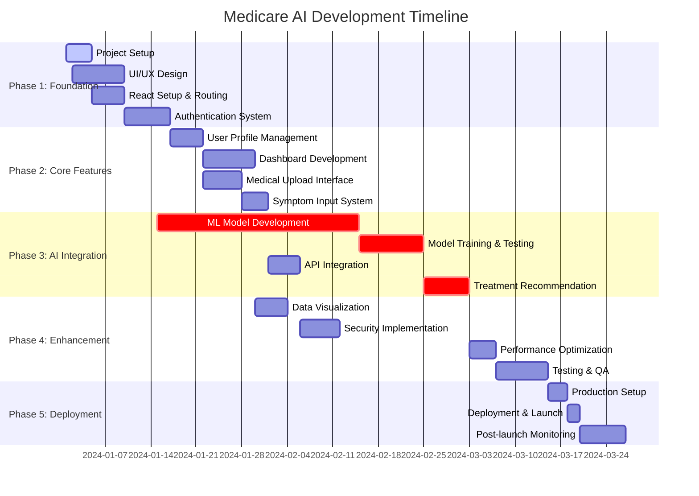
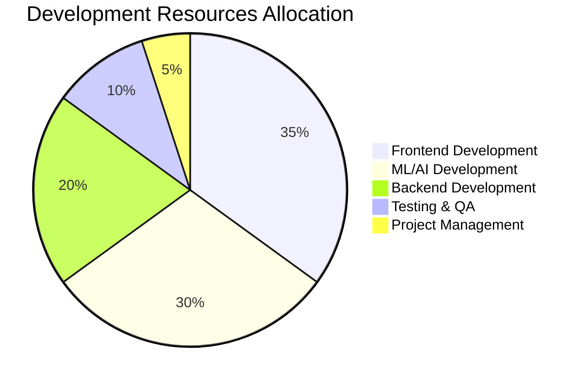

# Medicare AI System - PERT Chart & Project Timeline

## Project Phases & Critical Path

## PERT Network Diagram

```mermaid
graph LR
    A[Project Start] --> B[Setup Development Environment]
    B --> C[Design UI/UX]
    B --> D[React Application Setup]
    
    C --> E[Authentication System]
    D --> E
    
    E --> F[User Profile Management]
    F --> G[Dashboard Development]
    F --> H[Medical Upload Interface]
    
    H --> I[Symptom Input System]
    G --> J[Data Visualization]
    
    I --> K[API Integration]
    K --> L[ML Model Integration]
    
    M[ML Model Development] --> N[Model Training]
    N --> O[Model Testing]
    O --> L
    
    L --> P[Treatment Recommendation]
    P --> Q[Security Implementation]
    J --> Q
    
    Q --> R[Performance Optimization]
    R --> S[Testing & QA]
    S --> T[Production Deployment]
    T --> U[Project Complete]
    
    classDef critical fill:#ff6b6b,stroke:#333,stroke-width:3px
    classDef normal fill:#4ecdc4,stroke:#333,stroke-width:2px
    
    class M,N,O,L,P critical
    class A,B,C,D,E,F,G,H,I,J,K,Q,R,S,T,U normal
```

## Critical Path Analysis

### Critical Path: 45 days
1. **Project Start** → **ML Model Development** (10 days)
2. **Model Training** (10 days)
3. **Model Testing** (5 days)
4. **ML Model Integration** (7 days)
5. **Treatment Recommendation** (7 days)
6. **Testing & QA** (6 days)

### Non-Critical Activities
- UI/UX Design (float: 5 days)
- Data Visualization (float: 8 days)
- Security Implementation (float: 3 days)

## Resource Allocation

## Risk Assessment Matrix

| Risk Factor | Probability | Impact | Mitigation Strategy |
|-------------|-------------|---------|-------------------|
| ML Model Accuracy | Medium | High | Extensive testing with medical datasets |
| User Data Security | Low | Critical | Implement end-to-end encryption |
| Performance Issues | Medium | Medium | Regular performance testing |
| Integration Complexity | High | Medium | Modular development approach |
| Regulatory Compliance | Medium | High | Early consultation with healthcare experts |

## Milestones & Deliverables

### Phase 1 Deliverables (Week 1-2)
- ✅ Development environment setup
- ✅ Basic React application with routing
- ✅ Authentication system implementation
- ✅ Initial UI components

### Phase 2 Deliverables (Week 3-4)
- ✅ User profile management
- ✅ Dashboard interface
- ✅ Medical file upload functionality
- ✅ Symptom input forms

### Phase 3 Deliverables (Week 5-8)
- 🔄 ML model development (In Progress)
- 🔄 Model training and validation
- 🔄 API integration
- 🔄 Treatment recommendation engine

### Phase 4 Deliverables (Week 9-10)
- ⏳ Security enhancements
- ⏳ Performance optimization
- ⏳ Comprehensive testing
- ⏳ Documentation completion

### Phase 5 Deliverables (Week 11-12)
- ⏳ Production deployment
- ⏳ User acceptance testing
- ⏳ System monitoring setup
- ⏳ Project handover
