# Medicare AI System - PERT Chart & Project Timeline

## Gantt Chart - Project Timeline

```mermaid
gantt
    title Medicare AI Development - Academic Project Timeline
    dateFormat  YYYY-MM-DD
    axisFormat  %b %d
    
    section 📋 Phase 1: Requirements & Design
    Literature Review                    :lit,        2024-01-01, 2024-01-07
    Requirements Analysis               :req,        2024-01-03, 2024-01-10
    System Design                       :design,     2024-01-08, 2024-01-15
    UI/UX Mockups                      :mockup,     2024-01-12, 2024-01-18
    
    section ⚛️ Phase 2: Frontend Development
    React Setup & Configuration        :react,      2024-01-16, 2024-01-20
    Authentication Components          :auth,       2024-01-20, 2024-01-27
    User Interface Development         :ui,         2024-01-25, 2024-02-05
    Dashboard Implementation           :dashboard,  2024-02-03, 2024-02-12
    
    section ⚙️ Phase 3: Backend Development
    API Architecture                   :api,        2024-02-01, 2024-02-08
    Database Design & Setup           :db,         2024-02-06, 2024-02-13
    Authentication Services            :auth-be,    2024-02-10, 2024-02-17
    File Upload System                 :upload,     2024-02-15, 2024-02-22
    
    section 🤖 Phase 4: AI/ML Implementation
    Model Research & Selection         :crit, ml-research, 2024-02-05, 2024-02-15
    Data Preprocessing Pipeline        :crit, data-prep,   2024-02-13, 2024-02-20
    Model Training & Validation        :crit, training,    2024-02-18, 2024-03-05
    AI Service Integration             :crit, ai-int,      2024-03-03, 2024-03-12
    
    section 🔗 Phase 5: Integration & Testing
    Frontend-Backend Integration       :integration, 2024-03-10, 2024-03-17
    Unit Testing                       :unit-test,   2024-03-15, 2024-03-22
    Integration Testing                :int-test,    2024-03-20, 2024-03-27
    User Acceptance Testing            :uat,         2024-03-25, 2024-04-01
    
    section 🚀 Phase 6: Deployment & Documentation
    Production Deployment              :deploy,      2024-03-29, 2024-04-05
    Performance Optimization           :optimize,    2024-04-03, 2024-04-10
    Documentation & Report             :docs,        2024-04-08, 2024-04-20
    Final Presentation Prep            :presentation, 2024-04-18, 2024-04-25
```

## PERT Network Diagram - Critical Path Analysis

```mermaid
graph LR
    A[🏁 Project Start<br/>Day 0] --> B[📚 Literature Review<br/>7 days]
    A --> C[📋 Requirements Analysis<br/>8 days]
    
    B --> D[🎨 System Design<br/>7 days]
    C --> D
    
    D --> E[⚛️ React Setup<br/>4 days]
    D --> F[🤖 ML Research<br/>10 days]
    
    E --> G[🔐 Frontend Auth<br/>7 days]
    F --> H[📊 Data Preprocessing<br/>7 days]
    
    G --> I[🖥️ UI Development<br/>11 days]
    H --> J[🧠 Model Training<br/>15 days]
    
    I --> K[📊 Dashboard<br/>9 days]
    J --> L[🔗 AI Integration<br/>9 days]
    
    K --> M[🔧 Backend API<br/>7 days]
    L --> M
    
    M --> N[📁 File Upload<br/>7 days]
    N --> O[🔗 System Integration<br/>7 days]
    
    O --> P[🧪 Testing Phase<br/>12 days]
    P --> Q[🚀 Deployment<br/>7 days]
    
    Q --> R[📝 Documentation<br/>12 days]
    R --> S[🎯 Project Complete<br/>Day 115]
    
    classDef critical fill:#ff6b6b,stroke:#d32f2f,stroke-width:4px,color:#fff
    classDef normal fill:#4ecdc4,stroke:#00796b,stroke-width:2px,color:#000
    classDef milestone fill:#ffd54f,stroke:#f57f17,stroke-width:3px,color:#000
    
    class F,H,J,L critical
    class A,B,C,D,E,G,I,K,M,N,O,P,Q,R normal
    class S milestone
```

## Resource Allocation Matrix

## Critical Path Analysis

### **Critical Path Duration: 85 Days**

**Critical Activities Sequence:**
1. **ML Research** (10 days) → **Data Preprocessing** (7 days) → **Model Training** (15 days) → **AI Integration** (9 days)

**Total Critical Path Time:** 41 days for ML pipeline

### **Risk Assessment & Mitigation**

| **Risk Factor** | **Probability** | **Impact** | **Days at Risk** | **Mitigation Strategy** |
|-----------------|-----------------|------------|------------------|-------------------------|
| ML Model Accuracy | High | Critical | +15 days | Parallel model development, multiple algorithms |
| Data Quality Issues | Medium | High | +10 days | Early data validation, preprocessing automation |
| Integration Complexity | Medium | Medium | +7 days | Continuous integration, modular development |
| Performance Bottlenecks | Low | Medium | +5 days | Load testing, optimization cycles |
| Team Availability | Low | High | +14 days | Cross-training, documentation |

### **Float Analysis**

```mermaid
graph LR
    subgraph "🔴 Critical Path (0 Float)"
        CP1[ML Research<br/>Float: 0 days]
        CP2[Data Prep<br/>Float: 0 days]
        CP3[Model Training<br/>Float: 0 days]
        CP4[AI Integration<br/>Float: 0 days]
    end
    
    subgraph "🟡 Near Critical (1-5 Float)"
        NC1[React Setup<br/>Float: 3 days]
        NC2[Backend API<br/>Float: 2 days]
        NC3[Testing<br/>Float: 1 day]
    end
    
    subgraph "🟢 Non-Critical (5+ Float)"
        NNC1[Literature Review<br/>Float: 8 days]
        NNC2[UI Development<br/>Float: 6 days]
        NNC3[Documentation<br/>Float: 12 days]
    end
    
    style CP1 fill:#ffebee,stroke:#d32f2f,stroke-width:3px
    style CP2 fill:#ffebee,stroke:#d32f2f,stroke-width:3px
    style CP3 fill:#ffebee,stroke:#d32f2f,stroke-width:3px
    style CP4 fill:#ffebee,stroke:#d32f2f,stroke-width:3px
    
    style NC1 fill:#fff8e1,stroke:#f57f17,stroke-width:2px
    style NC2 fill:#fff8e1,stroke:#f57f17,stroke-width:2px
    style NC3 fill:#fff8e1,stroke:#f57f17,stroke-width:2px
    
    style NNC1 fill:#e8f5e8,stroke:#388e3c,stroke-width:2px
    style NNC2 fill:#e8f5e8,stroke:#388e3c,stroke-width:2px
    style NNC3 fill:#e8f5e8,stroke:#388e3c,stroke-width:2px
```

## Academic Deliverables Schedule

### **Phase-wise Deliverables**

| **Phase** | **Week** | **Deliverable** | **Submission Date** | **Weight** |
|-----------|----------|-----------------|---------------------|------------|
| Phase 1 | Week 2 | Requirements Document | 2024-01-15 | 10% |
| Phase 2 | Week 6 | Frontend Prototype | 2024-02-12 | 15% |
| Phase 3 | Week 8 | Backend API Demo | 2024-02-26 | 15% |
| Phase 4 | Week 12 | ML Model Integration | 2024-03-25 | 25% |
| Phase 5 | Week 14 | Complete System Demo | 2024-04-08 | 20% |
| Phase 6 | Week 16 | Final Report & Presentation | 2024-04-22 | 15% |

### **Quality Gates**

```mermaid
graph TD
    QG1[📋 Requirements Review<br/>✅ Stakeholder Approval]
    QG2[🎨 Design Review<br/>✅ Architecture Validation]
    QG3[⚛️ Frontend Review<br/>✅ UI/UX Compliance]
    QG4[⚙️ Backend Review<br/>✅ API Standards]
    QG5[🤖 ML Review<br/>✅ Model Performance]
    QG6[🧪 Testing Review<br/>✅ Quality Metrics]
    QG7[🚀 Deployment Review<br/>✅ Production Ready]
    
    QG1 --> QG2
    QG2 --> QG3
    QG2 --> QG4
    QG2 --> QG5
    QG3 --> QG6
    QG4 --> QG6
    QG5 --> QG6
    QG6 --> QG7
    
    style QG1 fill:#e3f2fd,stroke:#1565c0,stroke-width:2px
    style QG2 fill:#e8f5e8,stroke:#2e7d32,stroke-width:2px
    style QG3 fill:#fff3e0,stroke:#f57c00,stroke-width:2px
    style QG4 fill:#f3e5f5,stroke:#7b1fa2,stroke-width:2px
    style QG5 fill:#fce4ec,stroke:#c2185b,stroke-width:2px
    style QG6 fill:#e0f2f1,stroke:#00695c,stroke-width:2px
    style QG7 fill:#e8eaf6,stroke:#3f51b5,stroke-width:2px
```

