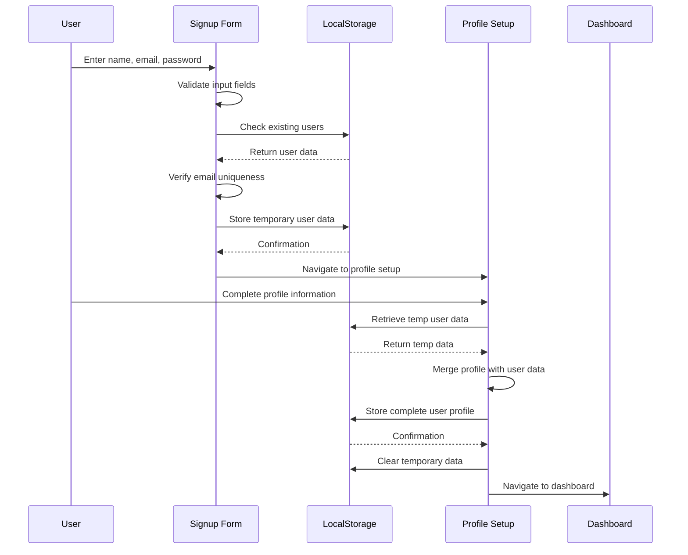
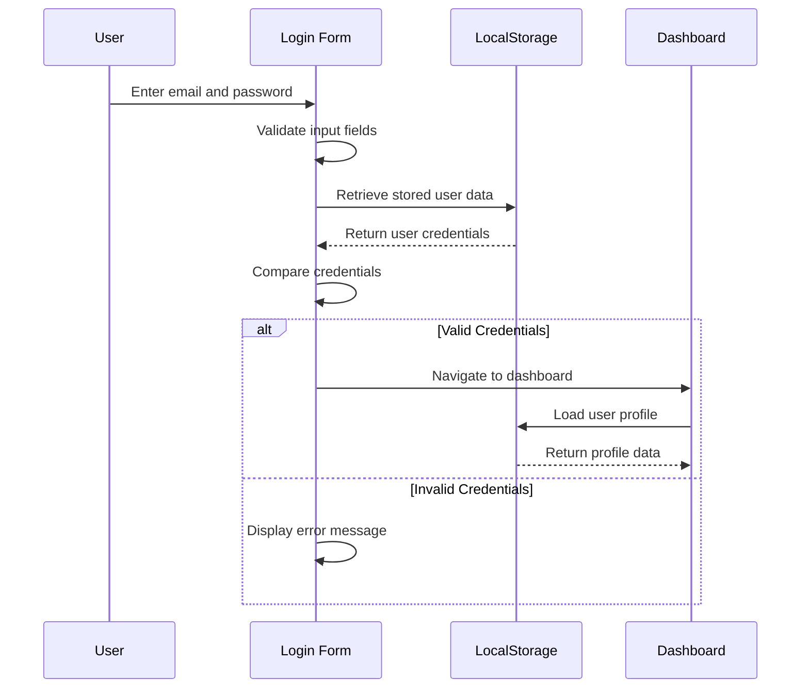
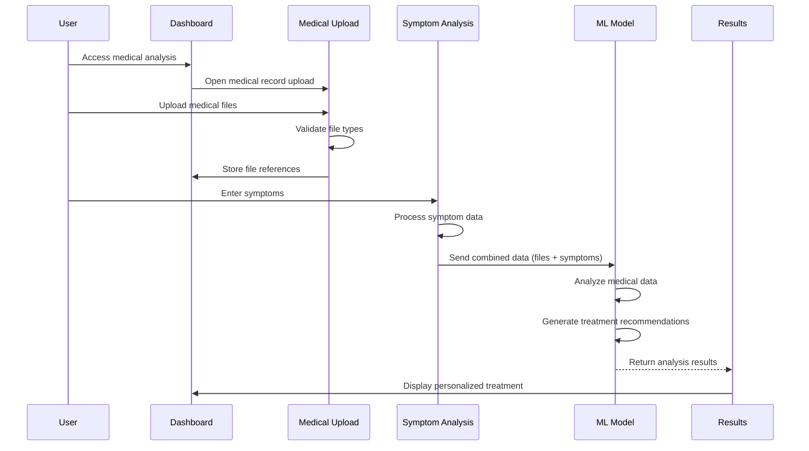
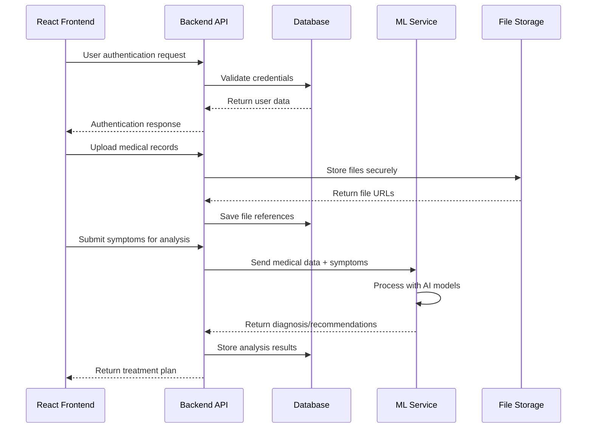

# Medicare AI System - Sequence Diagrams

## User Registration & Profile Setup Sequence

```mermaid
sequenceDiagram
    participant U as User
    participant SF as Signup Form
    participant LS as LocalStorage
    participant PS as Profile Setup
    participant D as Dashboard

    U->>SF: Enter name, email, password
    SF->>SF: Validate input fields
    SF->>LS: Check existing users
    LS-->>SF: Return user data
    SF->>SF: Verify email uniqueness
    SF->>LS: Store temporary user data
    LS-->>SF: Confirmation
    SF->>PS: Navigate to profile setup
    
    U->>PS: Complete profile information
    PS->>LS: Retrieve temp user data
    LS-->>PS: Return temp data
    PS->>PS: Merge profile with user data
    PS->>LS: Store complete user profile
    LS-->>PS: Confirmation
    PS->>LS: Clear temporary data
    PS->>D: Navigate to dashboard
```

## User Login Sequence

```mermaid
sequenceDiagram
    participant U as User
    participant LF as Login Form
    participant LS as LocalStorage
    participant D as Dashboard

    U->>LF: Enter email and password
    LF->>LF: Validate input fields
    LF->>LS: Retrieve stored user data
    LS-->>LF: Return user credentials
    LF->>LF: Compare credentials
    
    alt Valid Credentials
        LF->>D: Navigate to dashboard
        D->>LS: Load user profile
        LS-->>D: Return profile data
    else Invalid Credentials
        LF->>LF: Display error message
    end
```

## Medical Analysis Workflow

```mermaid
sequenceDiagram
    participant U as User
    participant D as Dashboard
    participant MU as Medical Upload
    participant SA as Symptom Analysis
    participant ML as ML Model
    participant R as Results

    U->>D: Access medical analysis
    D->>MU: Open medical record upload
    U->>MU: Upload medical files
    MU->>MU: Validate file types
    MU->>D: Store file references
    
    U->>SA: Enter symptoms
    SA->>SA: Process symptom data
    SA->>ML: Send combined data (files + symptoms)
    ML->>ML: Analyze medical data
    ML->>ML: Generate treatment recommendations
    ML-->>R: Return analysis results
    R->>D: Display personalized treatment
```

## System Architecture Flow

```mermaid
sequenceDiagram
    participant UI as React Frontend
    participant API as Backend API
    participant DB as Database
    participant ML as ML Service
    participant FS as File Storage

    UI->>API: User authentication request
    API->>DB: Validate credentials
    DB-->>API: Return user data
    API-->>UI: Authentication response
    
    UI->>API: Upload medical records
    API->>FS: Store files securely
    FS-->>API: Return file URLs
    API->>DB: Save file references
    
    UI->>API: Submit symptoms for analysis
    API->>ML: Send medical data + symptoms
    ML->>ML: Process with AI models
    ML-->>API: Return diagnosis/recommendations
    API->>DB: Store analysis results
    API-->>UI: Return treatment plan
```
