# Medicare AI System - Sequence Diagrams

## User Registration & Profile Setup Sequence

```mermaid
sequenceDiagram
    participant U as 👤 User
    participant SF as 📝 Signup Form
    participant VS as ✅ Validation Service
    participant LS as 💾 Local Storage
    participant PS as 👤 Profile Setup
    participant D as 📊 Dashboard

    Note over U,D: User Registration Flow
    
    U->>SF: Enter registration details<br/>(name, email, password)
    SF->>VS: Validate input format
    VS-->>SF: Validation result
    
    alt Valid Input
        SF->>LS: Check existing users
        LS-->>SF: User data retrieved
        SF->>SF: Verify email uniqueness
        
        alt Email Available
            SF->>LS: Store temporary user data<br/>medicareUserTemp
            LS-->>SF: Storage confirmation
            SF->>PS: Navigate to profile setup
            
            Note over PS: Profile Information Collection
            U->>PS: Complete medical profile<br/>(age, gender, height, weight, medical history)
            PS->>LS: Retrieve temporary data
            LS-->>PS: Temporary user data
            PS->>PS: Merge profile with user data
            PS->>LS: Store complete user object<br/>medicareUser
            LS-->>PS: Final storage confirmation
            PS->>LS: Clear temporary data
            PS->>D: Navigate to dashboard
            
        else Email Exists
            SF->>U: Display "Email already registered"
        end
        
    else Invalid Input
        SF->>U: Display validation errors
    end
```

## User Authentication (Login) Sequence

```mermaid
sequenceDiagram
    participant U as 👤 User
    participant LF as 🔐 Login Form
    participant VS as ✅ Validation Service
    participant LS as 💾 Local Storage
    participant AS as 🔑 Auth Service
    participant D as 📊 Dashboard

    Note over U,D: User Login Flow
    
    U->>LF: Enter credentials<br/>(email, password)
    LF->>VS: Validate input format
    VS-->>LF: Format validation result
    
    alt Valid Format
        LF->>LS: Retrieve stored user data
        LS-->>LF: User credentials
        LF->>AS: Authenticate credentials
        AS->>AS: Compare email & password
        
        alt Valid Credentials
            AS-->>LF: Authentication success
            LF->>LS: Update last login timestamp
            LS-->>LF: Update confirmation
            LF->>D: Navigate to dashboard
            D->>LS: Load user profile data
            LS-->>D: Complete user profile
            D->>U: Display personalized dashboard
            
        else Invalid Credentials
            AS-->>LF: Authentication failed
            LF->>U: Display "Invalid email or password"
            
        end
        
    else Invalid Format
        LF->>U: Display format errors
    end
```

## Medical Document Upload & Analysis Workflow

```mermaid
sequenceDiagram
    participant U as 👤 User
    participant D as 📊 Dashboard
    participant FU as 📁 File Upload Component
    participant FV as ✅ File Validator
    participant FS as 💾 File Storage
    participant AI as 🤖 AI Analysis Engine
    participant R as 📋 Results Display

    Note over U,R: Medical Document Processing Flow
    
    U->>D: Access medical analysis section
    D->>FU: Open file upload interface
    
    U->>FU: Select medical documents<br/>(PDF, JPEG, PNG)
    FU->>FV: Validate file types & sizes
    FV-->>FU: Validation result
    
    alt Valid Files
        FU->>FS: Store files in browser storage
        FS-->>FU: Storage confirmation
        FU->>D: Update file list display
        
        U->>D: Initiate analysis
        D->>AI: Send files for processing
        AI->>AI: Extract text from documents
        AI->>AI: Identify medical entities
        AI->>AI: Classify medical conditions
        AI-->>D: Return extracted data
        D->>R: Display analysis preview
        
    else Invalid Files
        FV-->>FU: File validation errors
        FU->>U: Display file format/size errors
    end
```

## Symptom Analysis & Treatment Recommendation Sequence

```mermaid
sequenceDiagram
    participant U as 👤 User
    participant SI as 🩺 Symptom Input Form
    participant SV as ✅ Symptom Validator
    participant LS as 💾 Local Storage
    participant ML as 🧠 ML Processing Engine
    participant TA as 💊 Treatment Algorithm
    participant RD as 📊 Results Dashboard

    Note over U,RD: Symptom Analysis & Treatment Flow
    
    U->>SI: Input symptoms<br/>(description, severity, duration)
    SI->>SV: Validate symptom data
    SV-->>SI: Validation result
    
    alt Valid Symptoms
        SI->>LS: Retrieve user medical profile
        LS-->>SI: Profile data (age, gender, medical history)
        SI->>ML: Send combined data<br/>(symptoms + profile + uploaded docs)
        
        Note over ML: AI Processing Pipeline
        ML->>ML: Preprocess symptom text
        ML->>ML: Apply NLP models
        ML->>ML: Cross-reference medical history
        ML->>ML: Analyze uploaded documents
        ML->>TA: Send processed data
        
        TA->>TA: Generate differential diagnosis
        TA->>TA: Calculate risk factors
        TA->>TA: Recommend treatments
        TA->>TA: Suggest specialist referrals
        TA-->>ML: Treatment recommendations
        
        ML-->>SI: Complete analysis results
        SI->>LS: Cache analysis results
        LS-->>SI: Cache confirmation
        SI->>RD: Display results
        RD->>U: Show treatment plan & recommendations
        
    else Invalid Symptoms
        SV-->>SI: Symptom validation errors
        SI->>U: Display input errors
    end
```

## Complete System Interaction Flow

```mermaid
sequenceDiagram
    participant U as 👤 User
    participant FE as 🖥️ Frontend (React)
    participant API as 🔗 Backend API
    participant DB as 💾 Database
    participant ML as 🤖 ML Service
    participant EXT as 🌐 External APIs

    Note over U,EXT: End-to-End System Flow
    
    rect rgb(240, 248, 255)
        Note over U,EXT: Authentication Phase
        U->>FE: Login request
        FE->>API: POST /auth/login
        API->>DB: Validate credentials
        DB-->>API: User data
        API-->>FE: JWT token + user profile
        FE-->>U: Dashboard access granted
    end
    
    rect rgb(248, 255, 240)
        Note over U,EXT: Medical Data Upload
        U->>FE: Upload medical files
        FE->>API: POST /medical/upload
        API->>DB: Store file metadata
        API->>ML: Process medical documents
        ML-->>API: Extracted medical data
        API->>DB: Store processed data
        API-->>FE: Upload confirmation
        FE-->>U: File upload successful
    end
    
    rect rgb(255, 248, 240)
        Note over U,EXT: Symptom Analysis
        U->>FE: Submit symptoms
        FE->>API: POST /analysis/symptoms
        API->>DB: Retrieve user medical history
        API->>ML: Analyze symptoms + history
        ML->>EXT: Query medical databases
        EXT-->>ML: Medical references
        ML-->>API: Analysis results
        API->>DB: Store analysis
        API-->>FE: Treatment recommendations
        FE-->>U: Display results
    end
    
    rect rgb(255, 240, 248)
        Note over U,EXT: Report Generation
        U->>FE: Request health report
        FE->>API: GET /reports/health
        API->>DB: Aggregate user data
        DB-->>API: Complete health profile
        API-->>FE: Generated report
        FE-->>U: Download/view report
    end
```

## Error Handling & Edge Cases

