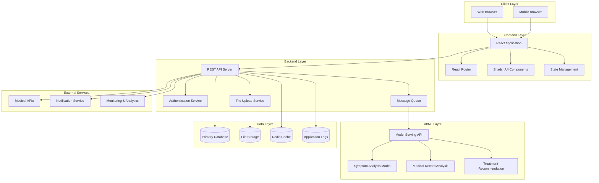
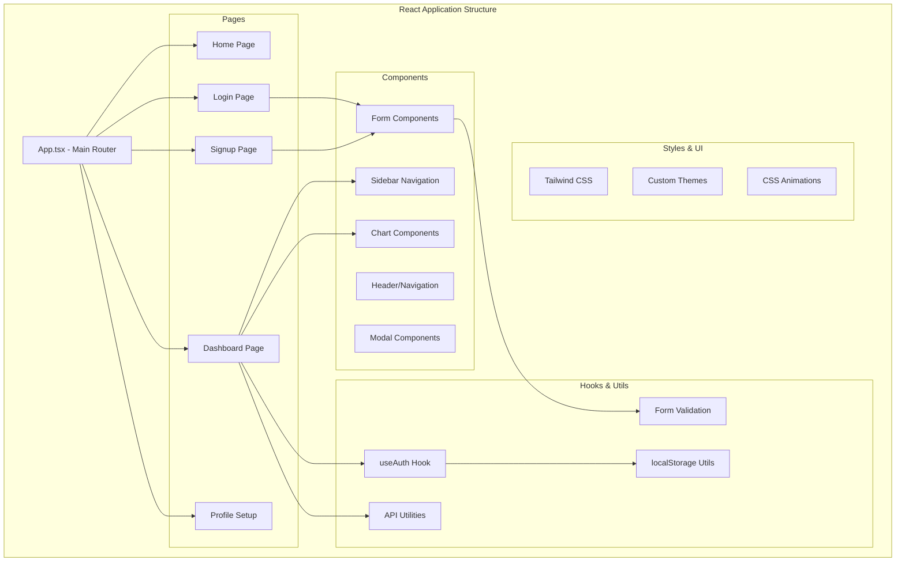
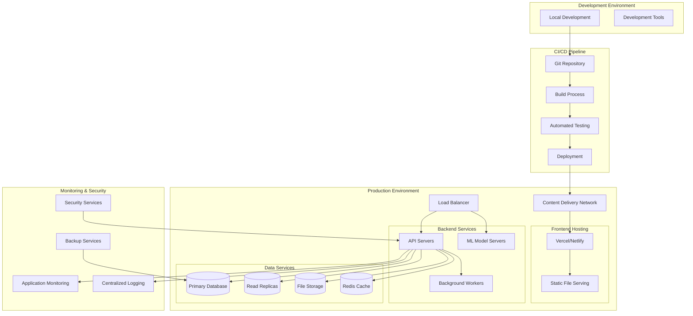

# Medicare AI System - System Architecture

## High-Level Architecture

```mermaid
graph TB
    subgraph "Client Layer"
        WEB[Web Browser]
        MOBILE[Mobile Browser]
    end
    
    subgraph "Frontend Layer"
        REACT[React Application]
        ROUTER[React Router]
        UI[Shadcn/UI Components]
        STATE[State Management]
    end
    
    subgraph "Backend Layer"
        API[REST API Server]
        AUTH[Authentication Service]
        FILE[File Upload Service]
        QUEUE[Message Queue]
    end
    
    subgraph "AI/ML Layer"
        SYMPTOM_AI[Symptom Analysis Model]
        MEDICAL_AI[Medical Record Analysis]
        TREATMENT_AI[Treatment Recommendation]
        MODEL_API[Model Serving API]
    end
    
    subgraph "Data Layer"
        PRIMARY_DB[(Primary Database)]
        FILE_STORAGE[(File Storage)]
        CACHE[(Redis Cache)]
        LOGS[(Application Logs)]
    end
    
    subgraph "External Services"
        MEDICAL_API[Medical APIs]
        NOTIFICATION[Notification Service]
        MONITORING[Monitoring & Analytics]
    end
    
    WEB --> REACT
    MOBILE --> REACT
    REACT --> ROUTER
    REACT --> UI
    REACT --> STATE
    
    REACT --> API
    API --> AUTH
    API --> FILE
    API --> QUEUE
    
    QUEUE --> MODEL_API
    MODEL_API --> SYMPTOM_AI
    MODEL_API --> MEDICAL_AI
    MODEL_API --> TREATMENT_AI
    
    API --> PRIMARY_DB
    FILE --> FILE_STORAGE
    API --> CACHE
    API --> LOGS
    
    API --> MEDICAL_API
    API --> NOTIFICATION
    API --> MONITORING
```

## Component Architecture

```mermaid
graph TD
    subgraph "React Application Structure"
        APP[App.tsx - Main Router]
        
        subgraph "Pages"
            HOME[Home Page]
            LOGIN[Login Page]
            SIGNUP[Signup Page]
            DASHBOARD[Dashboard Page]
            PROFILE[Profile Setup]
        end
        
        subgraph "Components"
            HEADER[Header/Navigation]
            SIDEBAR[Sidebar Navigation]
            FORMS[Form Components]
            CHARTS[Chart Components]
            MODALS[Modal Components]
        end
        
        subgraph "Hooks & Utils"
            AUTH_HOOK[useAuth Hook]
            STORAGE[localStorage Utils]
            API_UTILS[API Utilities]
            VALIDATION[Form Validation]
        end
        
        subgraph "Styles & UI"
            TAILWIND[Tailwind CSS]
            THEMES[Custom Themes]
            ANIMATIONS[CSS Animations]
        end
    end
    
    APP --> HOME
    APP --> LOGIN
    APP --> SIGNUP
    APP --> DASHBOARD
    APP --> PROFILE
    
    DASHBOARD --> SIDEBAR
    DASHBOARD --> CHARTS
    LOGIN --> FORMS
    SIGNUP --> FORMS
    
    FORMS --> VALIDATION
    DASHBOARD --> AUTH_HOOK
    AUTH_HOOK --> STORAGE
    DASHBOARD --> API_UTILS
```

## Deployment Architecture

```mermaid
graph TB
    subgraph "Development Environment"
        DEV_LOCAL[Local Development]
        DEV_TOOLS[Development Tools]
    end
    
    subgraph "CI/CD Pipeline"
        GIT[Git Repository]
        BUILD[Build Process]
        TEST[Automated Testing]
        DEPLOY[Deployment]
    end
    
    subgraph "Production Environment"
        CDN[Content Delivery Network]
        LB[Load Balancer]
        
        subgraph "Frontend Hosting"
            VERCEL[Vercel/Netlify]
            STATIC[Static File Serving]
        end
        
        subgraph "Backend Services"
            API_SERVER[API Servers]
            ML_SERVER[ML Model Servers]
            WORKER[Background Workers]
        end
        
        subgraph "Data Services"
            DB_PRIMARY[(Primary Database)]
            DB_REPLICA[(Read Replicas)]
            STORAGE_PROD[(File Storage)]
            CACHE_PROD[(Redis Cache)]
        end
    end
    
    subgraph "Monitoring & Security"
        MONITORING_PROD[Application Monitoring]
        LOGGING[Centralized Logging]
        SECURITY[Security Services]
        BACKUP[Backup Services]
    end
    
    DEV_LOCAL --> GIT
    GIT --> BUILD
    BUILD --> TEST
    TEST --> DEPLOY
    
    DEPLOY --> CDN
    CDN --> VERCEL
    VERCEL --> STATIC
    
    LB --> API_SERVER
    LB --> ML_SERVER
    API_SERVER --> WORKER
    
    API_SERVER --> DB_PRIMARY
    API_SERVER --> DB_REPLICA
    API_SERVER --> STORAGE_PROD
    API_SERVER --> CACHE_PROD
    
    API_SERVER --> MONITORING_PROD
    API_SERVER --> LOGGING
    SECURITY --> API_SERVER
    BACKUP --> DB_PRIMARY
```
