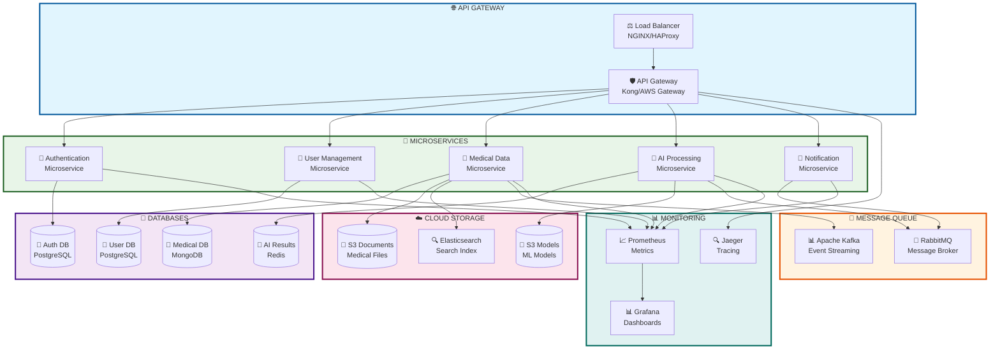
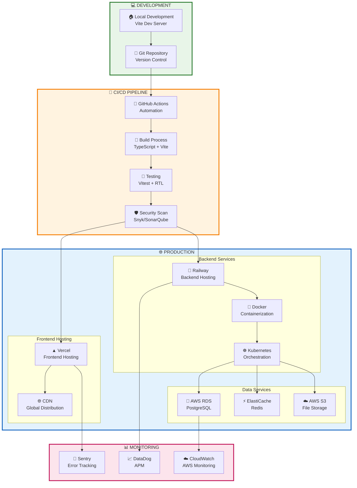

# Medicare AI System - System Architecture

## Three-Tier Architecture Overview

```mermaid
graph TB
    subgraph Presentation["🖥️ PRESENTATION TIER"]
        subgraph Client["Client Layer"]
            BROWSER[🌐 Web Browser<br/>Chrome, Firefox, Safari]
            MOBILE[📱 Mobile Browser<br/>Responsive Design]
        end
        
        subgraph Frontend["Frontend Application"]
            REACT[⚛️ React 18.3.1<br/>TypeScript]
            ROUTER[🛣️ React Router<br/>Navigation]
            UI[🎨 Shadcn/UI<br/>Component Library]
            TAILWIND[🎨 Tailwind CSS<br/>Styling Framework]
        end
    end
    
    subgraph Logic["⚙️ APPLICATION TIER"]
        subgraph API["API Gateway"]
            REST[📡 REST API<br/>Express.js]
            AUTH_API[🔐 Authentication<br/>JWT Service]
            FILE_API[📁 File Upload<br/>Multer Service]
        end
        
        subgraph Business["Business Logic"]
            USER_SVC[👤 User Service<br/>Management]
            PROFILE_SVC[👤 Profile Service<br/>Medical Data]
            ANALYSIS_SVC[🧠 Analysis Service<br/>Orchestrator]
        end
        
        subgraph ML["AI/ML Services"]
            SYMPTOM_ML[🩺 Symptom Analysis<br/>TensorFlow Model]
            MEDICAL_ML[📋 Medical NLP<br/>BERT/GPT Model]
            TREATMENT_ML[💊 Treatment Rec<br/>ML Pipeline]
        end
    end
    
    subgraph Data["💾 DATA TIER"]
        subgraph Primary["Primary Storage"]
            POSTGRES[(🐘 PostgreSQL<br/>User & Profile Data)]
            REDIS[(⚡ Redis Cache<br/>Session & Results)]
        end
        
        subgraph Files["File Storage"]
            S3[(☁️ AWS S3<br/>Medical Documents)]
            CDN[🌐 CloudFront CDN<br/>Static Assets]
        end
        
        subgraph Analytics["Analytics"]
            LOGS[(📊 ELK Stack<br/>Application Logs)]
            METRICS[(📈 Prometheus<br/>System Metrics)]
        end
    end
    
    subgraph External["🌐 EXTERNAL SERVICES"]
        MEDICAL_API[🏥 Medical APIs<br/>Drug Database]
        NOTIFY[📧 Notification<br/>Email/SMS]
        MONITOR[📊 Monitoring<br/>DataDog/New Relic]
    end
    
    BROWSER --> REACT
    MOBILE --> REACT
    REACT --> ROUTER
    REACT --> UI
    REACT --> TAILWIND
    
    REACT --> REST
    REST --> AUTH_API
    REST --> FILE_API
    
    AUTH_API --> USER_SVC
    FILE_API --> PROFILE_SVC
    REST --> ANALYSIS_SVC
    
    ANALYSIS_SVC --> SYMPTOM_ML
    ANALYSIS_SVC --> MEDICAL_ML
    ANALYSIS_SVC --> TREATMENT_ML
    
    USER_SVC --> POSTGRES
    PROFILE_SVC --> POSTGRES
    ANALYSIS_SVC --> REDIS
    
    FILE_API --> S3
    S3 --> CDN
    
    USER_SVC --> LOGS
    ANALYSIS_SVC --> METRICS
    
    ANALYSIS_SVC --> MEDICAL_API
    USER_SVC --> NOTIFY
    REST --> MONITOR
    
    style Presentation fill:#e3f2fd,stroke:#1565c0,stroke-width:3px
    style Logic fill:#e8f5e8,stroke:#2e7d32,stroke-width:3px
    style Data fill:#fce4ec,stroke:#c2185b,stroke-width:3px
    style External fill:#fff3e0,stroke:#f57c00,stroke-width:3px
```

## Microservices Architecture (Production)

```mermaid
graph TB
    subgraph Gateway["🌐 API GATEWAY"]
        LB[⚖️ Load Balancer<br/>NGINX/HAProxy]
        API_GW[🛡️ API Gateway<br/>Kong/AWS Gateway]
    end
    
    subgraph Services["🔧 MICROSERVICES"]
        AUTH_MS[🔐 Authentication<br/>Microservice]
        USER_MS[👤 User Management<br/>Microservice]
        MEDICAL_MS[🏥 Medical Data<br/>Microservice]
        AI_MS[🤖 AI Processing<br/>Microservice]
        NOTIFY_MS[📧 Notification<br/>Microservice]
    end
    
    subgraph Messaging["📨 MESSAGE QUEUE"]
        RABBIT[🐰 RabbitMQ<br/>Message Broker]
        KAFKA[📊 Apache Kafka<br/>Event Streaming]
    end
    
    subgraph Databases["💾 DATABASES"]
        AUTH_DB[(🔐 Auth DB<br/>PostgreSQL)]
        USER_DB[(👤 User DB<br/>PostgreSQL)]
        MEDICAL_DB[(🏥 Medical DB<br/>MongoDB)]
        AI_DB[(🤖 AI Results<br/>Redis)]
    end
    
    subgraph Storage["☁️ CLOUD STORAGE"]
        S3_DOCS[(📄 S3 Documents<br/>Medical Files)]
        S3_MODELS[(🧠 S3 Models<br/>ML Models)]
        ELASTIC[🔍 Elasticsearch<br/>Search Index]
    end
    
    subgraph Monitoring["📊 MONITORING"]
        PROMETHEUS[📈 Prometheus<br/>Metrics]
        GRAFANA[📊 Grafana<br/>Dashboards]
        JAEGER[🔍 Jaeger<br/>Tracing]
    end
    
    LB --> API_GW
    API_GW --> AUTH_MS
    API_GW --> USER_MS
    API_GW --> MEDICAL_MS
    API_GW --> AI_MS
    API_GW --> NOTIFY_MS
    
    AUTH_MS --> AUTH_DB
    USER_MS --> USER_DB
    MEDICAL_MS --> MEDICAL_DB
    AI_MS --> AI_DB
    
    MEDICAL_MS --> S3_DOCS
    AI_MS --> S3_MODELS
    MEDICAL_MS --> ELASTIC
    
    AI_MS --> RABBIT
    NOTIFY_MS --> RABBIT
    MEDICAL_MS --> KAFKA
    
    AUTH_MS --> PROMETHEUS
    USER_MS --> PROMETHEUS
    MEDICAL_MS --> PROMETHEUS
    AI_MS --> PROMETHEUS
    NOTIFY_MS --> PROMETHEUS
    
    PROMETHEUS --> GRAFANA
    API_GW --> JAEGER
    
    style Gateway fill:#e1f5fe,stroke:#01579b,stroke-width:3px
    style Services fill:#e8f5e8,stroke:#1b5e20,stroke-width:3px
    style Messaging fill:#fff3e0,stroke:#e65100,stroke-width:3px
    style Databases fill:#f3e5f5,stroke:#4a148c,stroke-width:3px
    style Storage fill:#fce4ec,stroke:#880e4f,stroke-width:3px
    style Monitoring fill:#e0f2f1,stroke:#00695c,stroke-width:3px
```

## Technology Stack Integration

```mermaid
graph LR
    subgraph Frontend["🖥️ Frontend Stack"]
        subgraph Core_FE["Core Technologies"]
            REACT_TECH[React 18.3.1<br/>TypeScript]
            VITE_TECH[Vite Build<br/>HMR]
        end
        
        subgraph UI_FE["UI/UX"]
            TAILWIND_TECH[Tailwind CSS<br/>Styling]
            SHADCN_TECH[Shadcn/UI<br/>Components]
            LUCIDE_TECH[Lucide Icons<br/>Icon Library]
        end
        
        subgraph State_FE["State Management"]
            HOOKS_TECH[React Hooks<br/>Local State]
            QUERY_TECH[TanStack Query<br/>Server State]
            STORAGE_TECH[localStorage<br/>Persistence]
        end
    end
    
    subgraph Backend["⚙️ Backend Stack"]
        subgraph Core_BE["Core Technologies"]
            NODE_TECH[Node.js<br/>Runtime]
            EXPRESS_TECH[Express.js<br/>Framework]
            TYPESCRIPT_BE[TypeScript<br/>Type Safety]
        end
        
        subgraph Database_BE["Database"]
            POSTGRES_TECH[PostgreSQL<br/>Primary DB]
            PRISMA_TECH[Prisma ORM<br/>Database Layer]
            REDIS_TECH[Redis<br/>Caching]
        end
        
        subgraph Auth_BE["Authentication"]
            JWT_TECH[JWT Tokens<br/>Authentication]
            BCRYPT_TECH[Bcrypt<br/>Password Hashing]
        end
    end
    
    subgraph ML["🤖 ML/AI Stack"]
        subgraph Core_ML["Core ML"]
            PYTHON_TECH[Python 3.9+<br/>Runtime]
            TENSORFLOW_TECH[TensorFlow<br/>ML Framework]
            PYTORCH_TECH[PyTorch<br/>Alternative]
        end
        
        subgraph Data_ML["Data Processing"]
            PANDAS_TECH[Pandas<br/>Data Manipulation]
            NUMPY_TECH[NumPy<br/>Numerical Computing]
            SKLEARN_TECH[Scikit-learn<br/>ML Algorithms]
        end
        
        subgraph NLP_ML["NLP/Medical AI"]
            TRANSFORMERS_TECH[Transformers<br/>BERT/GPT]
            SPACY_TECH[spaCy<br/>Medical NLP]
            FASTAPI_TECH[FastAPI<br/>ML API]
        end
    end
    
    Frontend --> Backend
    Backend --> ML
    
    style Frontend fill:#e3f2fd,stroke:#1565c0,stroke-width:3px
    style Backend fill:#e8f5e8,stroke:#2e7d32,stroke-width:3px
    style ML fill:#fff3e0,stroke:#f57c00,stroke-width:3px
```

## Deployment Architecture

```mermaid
graph TB
    subgraph Development["💻 DEVELOPMENT"]
        LOCAL[🏠 Local Development<br/>Vite Dev Server]
        GIT[📝 Git Repository<br/>Version Control]
    end
    
    subgraph CICD["🔄 CI/CD PIPELINE"]
        GITHUB[📁 GitHub Actions<br/>Automation]
        BUILD[🔨 Build Process<br/>TypeScript + Vite]
        TEST[🧪 Testing<br/>Vitest + RTL]
        SECURITY[🛡️ Security Scan<br/>Snyk/SonarQube]
    end
    
    subgraph Production["🌐 PRODUCTION"]
        subgraph Frontend_Prod["Frontend Hosting"]
            VERCEL[▲ Vercel<br/>Frontend Hosting]
            CDN_PROD[🌐 CDN<br/>Global Distribution]
        end
        
        subgraph Backend_Prod["Backend Services"]
            RAILWAY[🚂 Railway<br/>Backend Hosting]
            DOCKER[🐳 Docker<br/>Containerization]
            K8S[☸️ Kubernetes<br/>Orchestration]
        end
        
        subgraph Data_Prod["Data Services"]
            RDS[💾 AWS RDS<br/>PostgreSQL]
            ELASTICACHE[⚡ ElastiCache<br/>Redis]
            S3_PROD[☁️ AWS S3<br/>File Storage]
        end
    end
    
    subgraph Monitoring_Prod["📊 MONITORING"]
        SENTRY[🐛 Sentry<br/>Error Tracking]
        DATADOG[📈 DataDog<br/>APM]
        CLOUDWATCH[☁️ CloudWatch<br/>AWS Monitoring]
    end
    
    LOCAL --> GIT
    GIT --> GITHUB
    GITHUB --> BUILD
    BUILD --> TEST
    TEST --> SECURITY
    SECURITY --> VERCEL
    SECURITY --> RAILWAY
    
    VERCEL --> CDN_PROD
    RAILWAY --> DOCKER
    DOCKER --> K8S
    
    K8S --> RDS
    K8S --> ELASTICACHE
    K8S --> S3_PROD
    
    VERCEL --> SENTRY
    RAILWAY --> DATADOG
    RDS --> CLOUDWATCH
    
    style Development fill:#e8f5e8,stroke:#2e7d32,stroke-width:3px
    style CICD fill:#fff3e0,stroke:#f57c00,stroke-width:3px
    style Production fill:#e3f2fd,stroke:#1565c0,stroke-width:3px
    style Monitoring_Prod fill:#fce4ec,stroke:#c2185b,stroke-width:3px
```
