# Medicare AI System - Use Case Diagram

## Primary Use Case Diagram

```mermaid
graph TB
    subgraph System["🏥 Medicare AI System"]
        subgraph Authentication["🔐 Authentication"]
            UC1[Register Account]
            UC2[Login to System]
            UC3[Logout]
            UC4[Reset Password]
        end
        
        subgraph Profile["👤 Profile Management"]
            UC5[Setup Medical Profile]
            UC6[Update Profile Information]
            UC7[View Profile History]
            UC8[Manage Medical History]
        end
        
        subgraph Medical["🩺 Medical Analysis"]
            UC9[Upload Medical Documents]
            UC10[Input Symptoms]
            UC11[Analyze Medical Data]
            UC12[Generate Treatment Plan]
            UC13[View Analysis Results]
        end
        
        subgraph Dashboard["📊 Dashboard & Reports"]
            UC14[View Personal Dashboard]
            UC15[Generate Health Reports]
            UC16[Export Analysis Data]
            UC17[Schedule Appointments]
        end
        
        subgraph Admin["👨‍💼 Administration"]
            UC18[Manage User Accounts]
            UC19[Monitor System Performance]
            UC20[Update ML Models]
            UC21[Generate System Reports]
        end
    end
    
    subgraph Actors["👥 System Actors"]
        PATIENT[👤 Patient<br/>Primary User]
        DOCTOR[👨‍⚕️ Healthcare Provider<br/>Medical Professional]
        ADMIN_ACTOR[👨‍💼 System Administrator<br/>Technical Admin]
        EXTERNAL[🌐 External Systems<br/>Medical APIs]
    end
    
    %% Patient Use Cases
    PATIENT --> UC1
    PATIENT --> UC2
    PATIENT --> UC3
    PATIENT --> UC4
    PATIENT --> UC5
    PATIENT --> UC6
    PATIENT --> UC7
    PATIENT --> UC8
    PATIENT --> UC9
    PATIENT --> UC10
    PATIENT --> UC11
    PATIENT --> UC12
    PATIENT --> UC13
    PATIENT --> UC14
    PATIENT --> UC15
    PATIENT --> UC16
    PATIENT --> UC17
    
    %% Doctor Use Cases
    DOCTOR --> UC13
    DOCTOR --> UC15
    DOCTOR --> UC16
    DOCTOR --> UC17
    DOCTOR --> UC21
    
    %% Admin Use Cases
    ADMIN_ACTOR --> UC18
    ADMIN_ACTOR --> UC19
    ADMIN_ACTOR --> UC20
    ADMIN_ACTOR --> UC21
    
    %% External System Use Cases
    EXTERNAL --> UC11
    EXTERNAL --> UC12
    
    style System fill:#e3f2fd,stroke:#1565c0,stroke-width:3px
    style Authentication fill:#e8f5e8,stroke:#2e7d32,stroke-width:2px
    style Profile fill:#fff3e0,stroke:#f57c00,stroke-width:2px
    style Medical fill:#f3e5f5,stroke:#7b1fa2,stroke-width:2px
    style Dashboard fill:#fce4ec,stroke:#c2185b,stroke-width:2px
    style Admin fill:#e0f2f1,stroke:#00695c,stroke-width:2px
    style Actors fill:#f1f8e9,stroke:#388e3c,stroke-width:2px
```

## Detailed Use Case Specifications

### **UC1: Register Account**
- **Actor:** Patient
- **Precondition:** User has internet access and valid email
- **Main Flow:**
  1. User navigates to registration page
  2. User enters name, email, and password
  3. System validates input data
  4. System checks email uniqueness
  5. System stores user credentials
  6. System redirects to profile setup
- **Postcondition:** User account created successfully
- **Extensions:** Email already exists, Invalid password format

### **UC9: Upload Medical Documents**
- **Actor:** Patient
- **Precondition:** User is authenticated and has medical files
- **Main Flow:**
  1. User navigates to upload section
  2. User selects medical documents
  3. System validates file format and size
  4. System processes and stores files
  5. System extracts relevant medical data
  6. System updates user's medical record
- **Postcondition:** Medical documents stored and processed
- **Extensions:** Invalid file format, File size exceeded, Processing error

### **UC11: Analyze Medical Data**
- **Actor:** Patient, External Systems
- **Precondition:** Medical data and symptoms available
- **Main Flow:**
  1. System aggregates user's medical data
  2. System processes symptoms input
  3. AI models analyze combined data
  4. System generates preliminary diagnosis
  5. System creates treatment recommendations
  6. Results stored in user's record
- **Postcondition:** Analysis results available for review
- **Extensions:** Insufficient data, AI processing error, No recommendations available

## Actor-Use Case Matrix

| **Use Case** | **👤 Patient** | **👨‍⚕️ Doctor** | **👨‍💼 Admin** | **🌐 External** |
|--------------|----------------|------------------|-----------------|------------------|
| Register Account | ✅ Primary | ❌ | ❌ | ❌ |
| Login to System | ✅ Primary | ✅ Secondary | ✅ Secondary | ❌ |
| Setup Medical Profile | ✅ Primary | ❌ | ❌ | ❌ |
| Upload Medical Documents | ✅ Primary | ✅ Secondary | ❌ | ❌ |
| Input Symptoms | ✅ Primary | ❌ | ❌ | ❌ |
| Analyze Medical Data | ✅ Primary | ❌ | ❌ | ✅ Secondary |
| Generate Treatment Plan | ✅ Primary | ✅ Secondary | ❌ | ✅ Secondary |
| View Analysis Results | ✅ Primary | ✅ Secondary | ❌ | ❌ |
| Generate Health Reports | ✅ Primary | ✅ Primary | ❌ | ❌ |
| Manage User Accounts | ❌ | ❌ | ✅ Primary | ❌ |
| Monitor System Performance | ❌ | ❌ | ✅ Primary | ❌ |
| Update ML Models | ❌ | ❌ | ✅ Primary | ❌ |

## Use Case Relationships

```mermaid
graph TD
    subgraph Includes["📦 <<include>> Relationships"]
        UC_LOGIN[Login to System]
        UC_AUTH[Validate Authentication]
        UC_UPLOAD[Upload Documents]
        UC_VALIDATE[Validate File Format]
        UC_ANALYZE[Analyze Data]
        UC_PROCESS[Process with AI]
    end
    
    subgraph Extends["🔄 <<extend>> Relationships"]
        UC_REGISTER[Register Account]
        UC_PROFILE[Setup Profile]
        UC_VIEW[View Results]
        UC_EXPORT[Export Data]
        UC_SCHEDULE[Schedule Appointment]
    end
    
    UC_LOGIN -.->|<<include>>| UC_AUTH
    UC_UPLOAD -.->|<<include>>| UC_VALIDATE
    UC_ANALYZE -.->|<<include>>| UC_PROCESS
    
    UC_REGISTER -.->|<<extend>>| UC_PROFILE
    UC_VIEW -.->|<<extend>>| UC_EXPORT
    UC_VIEW -.->|<<extend>>| UC_SCHEDULE
    
    style UC_LOGIN fill:#e3f2fd,stroke:#1565c0,stroke-width:2px
    style UC_AUTH fill:#e8f5e8,stroke:#2e7d32,stroke-width:2px
    style UC_UPLOAD fill:#fff3e0,stroke:#f57c00,stroke-width:2px
    style UC_VALIDATE fill:#f3e5f5,stroke:#7b1fa2,stroke-width:2px
    style UC_ANALYZE fill:#fce4ec,stroke:#c2185b,stroke-width:2px
    style UC_PROCESS fill:#e0f2f1,stroke:#00695c,stroke-width:2px
```

## System Boundary and Context

```mermaid
graph LR
    subgraph External_Left["🌐 External Environment"]
        HOSPITAL[🏥 Hospital Systems<br/>EHR Integration]
        LAB[🧪 Laboratory<br/>Test Results]
        PHARMACY[💊 Pharmacy<br/>Prescription System]
    end
    
    subgraph System_Boundary["📱 Medicare AI System Boundary"]
        CORE[🧠 Core AI Engine<br/>Medical Analysis]
        USER_MGMT[👤 User Management<br/>Authentication]
        DATA_MGMT[💾 Data Management<br/>Storage & Retrieval]
    end
    
    subgraph External_Right["👥 Human Actors"]
        PATIENT_EXT[👤 Patients<br/>End Users]
        DOCTOR_EXT[👨‍⚕️ Healthcare Providers<br/>Medical Professionals]
        ADMIN_EXT[👨‍💼 System Administrators<br/>Technical Support]
    end
    
    HOSPITAL --> CORE
    LAB --> DATA_MGMT
    PHARMACY --> CORE
    
    PATIENT_EXT --> USER_MGMT
    DOCTOR_EXT --> CORE
    ADMIN_EXT --> USER_MGMT
    ADMIN_EXT --> DATA_MGMT
    
    style System_Boundary fill:#e3f2fd,stroke:#1565c0,stroke-width:4px
    style External_Left fill:#f1f8e9,stroke:#388e3c,stroke-width:2px
    style External_Right fill:#fff3e0,stroke:#f57c00,stroke-width:2px
```

